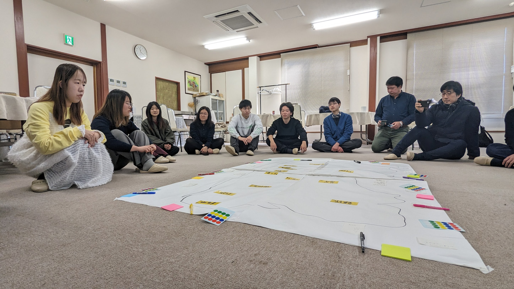

# Riria

## What did you do?

### 2/1から2/4

福島県南相馬市小高周辺地域におけるフィールドワークに参加し、調査を行いました。以下、全て咲季さんと美冬さんと行動しました。
### 2/2

- 東日本大震災・原子力災害伝承館見学、語り部講話、語り部さんへのインタビュー
- フルハウスでランチ、作業、店主の方へのインタビュー
### 2/3
- 俺たちの伝承館見学
- Fukushima Watch Company の平岡さんへのインタビュー
- ひまわりカフェで店主の方へのインタビュー
- フルハウス店内撮影、ランチ、作業
- パイオニアヴィレッジの交流会への参加、インタビュー(10名程度の方に一言ずつ紙に想いを書いてもらいました) 
- フォーラム発表の準備作業
2/4
- フォーラム発表

発表では、インタビュー動画のダイジェストの共有、ワークショップ(map制作,対話セッション)を行いました。

## What did you achieve?

私は今回の福島県で行われたフィールドワークを通して、4名の方へのインタビューを行うとともに、10名以上の方と交流会への参加を通して繋がりをもつことができた。特に、現地の方のあたたかさや全てを受け入れてくれるような優しさに触れることができ、それは地域の大きな魅力であると感じた。実際に現地に訪れる事でしか感じることのできない、五感を通した学びやつながり、新たな価値観に出会うことができた。私は、このフィールドワークに参加したことで、様々な人との繋がりを持つことのできる場所、安心して交流を深められる場所、過ごすことのできる居場所を作ることが大切であると感じた。最後に、インタビューや対話を通して「復興」についても改めてさまざまな視点から考えることができたのではないかと感じている。現地を訪れることで東日本大震災に対する表面的な知識(事実)、例えば原子力発電所の事故や津波による被害などだけではなく、内面的な事情(人々の想い)などにも注目することができ、そういった学習を行うことは現地に行くことでしか経験できないと考え、実際に今回経験することができた。	現地の方や移住された方など多くの方との交流を通して、また、インタビューなどでお話を聞くことによって、様々な立場や年齢、状況に置かれている方々がそれぞれ感じている想いを知ることができた。ワークショップなどを通して、自分たちの想いも共有することができた。