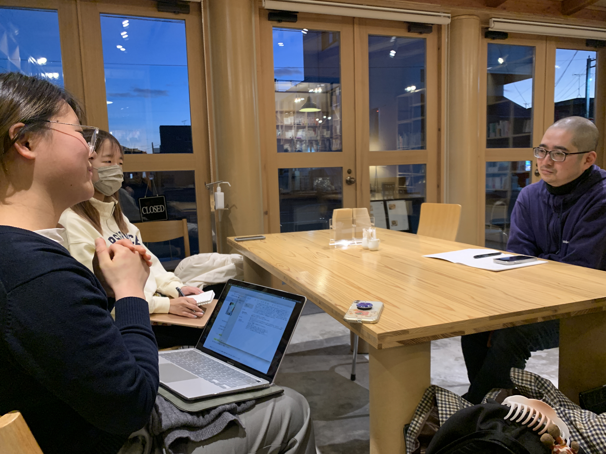

# 「アナログ版のマッピング作成ーポストイットで想いを伝えよう！ー」

私たちのプロジェクトチームでは4日間の福島県・浜通りのフィールドワークを通して、ネガティブな負の遺産だけではなく、まちの魅力や文化、人、歴史など震災前の潜在的なポジティブな面も目を向けて発信できるものを作りたいと考えた。そこで、デジタル化が基盤になっている社会で、あえてアナログ版（紙製）の浜通りのマップを作り、参加者は付箋で各所への気持ちや思い、思い出・出来事などナラティブに表現し、そして最後に出来上がったマップを見ながら参加者同士で新たな発見や気づきを得られたらいいと企画をした。デジタルでの利便性も理解した上で、あえてアナログにすることで、人が書いた文字が声となってデジタルよりもさらに「思い」というものが人へ伝わるのではないかと考えた。	このプロジェクトの目的は「人とのつながり」を参加者にとって感じてほしいという思いを込めて作った。誰に向けて作るのか、発信するのか考えた時に、福島県浜通りの被災に関わった当事者の人もそうではない都市部や他地方の人（ほとんどのゼミ参加者）が浜通りで何を感じたのかお互いに共有できる場を作りたかったためこのマッピングを提案した。	

## People we met

### 今泉春雄さん

- 東日本大震災・原子力災害伝承館で3.11の震災を経験し、語り部として活動している。
- 双葉町出身で、双葉町の伝統文化である標葉だんせん太鼓や双葉町ダルマ市、双葉盆踊りなどを次世代へ継承する願いを震災による人口減少から伝えている。

私たちは双葉町に東日本大震災と原子力災害の伝承館があることを知り、ただ展示物から3.11の出来事や震災や原子力の脅威を学ぶのではなく、語り部という実際に体験をした人からナラティブに知りたいと思い、聞きに行きました。今泉さんは3.11で故郷である双葉町が被災してしまった経験を語るだけではなく、震災が起こる前から長い間続いていた双葉町の伝統文化の魅力も見せてくれました。訪れた双葉町、小高町、浪江町は決して被災地という見方だけではなく、潜在的な美しい魅力も残っていることを見落としてはいけないということを気づかせてくれました。

### 村上朝晴さん

- 小高駅から徒歩３分くらいにあるブックカフェ「フルハウス」の副店長でもあり、カフェのオーナー兼小説家である柳美里さんのパートナー。
- TOMONI Projectのフィールドワークの宿泊先である双葉屋旅館の女将からフルハウスを紹介してもらい、なぜ小高町にブックカフェを開いたのかと小高町に住む理由を聞くため訪れに行った。

村上さんは作家の柳美里さんと東日本大震災を機に鎌倉市から南相馬市へ移住しました。移住したきっかけは、震災後被災と原発事故によって小高町や原町が警戒区域になって閉ざされてしまう前に一度自分の目で見なければならないということから地域と関わりをもつようになり毎月訪れるようになっていったそうです。それから、短期的ではなく長期的な関わりを持ちたい思い、そして当時小高駅周辺にあまり立ち寄ったりできるお店がなかったため地域の人々や子どもたちにとっての居場所が必要だということで2018年4月にブックカフェ フルハウスをオープンしました。私たちは元々小高町に住んでいたという人が震災後も戻ってきただけではなく、移住した人もいるということに関心を持ちました。なぜ小高町に移住してきたきっかけは震災ではなく地域と人とのつながりだったのだとインタビューをしていて知りました。「復興」というのは人によってさまざま。熱心にボランティアをしている人もいれば、被災した方たちや他地域から訪れた人たちが安心して一息できる居場所を作っている人もいる。この時、小高町には今さまざまな思いを持っている人々が集まってゆっくりと進んでいるようすがフルハウスの店内の様子やフルハウスのスタッフや村上さんとお話をしていて感じたような気がしました。

### 平岡雅康さん

- 株式会社Fukushima Watch Companyの創業者。地元である埼玉県大宮市から小高町へ移住。3.11の東日本大震災のボランティア活動で、趣味で花火を打ち上げながら東北各地を回っていた経験もあり、時計屋でもあり、花火師でもある。

私たちのプロジェクトの中での移住者のステークホルダーで平岡さんが村上さんに続く二人目の移住者の方でした。平岡さんも小高に来た理由、そして私たちが考える『「復興」とは何か。』について話してくださいました。平岡さんは震災後よく岩手県石巻市雄勝町にボランティア活動で行っていましたが、その地域は約9割が津波によって流されてしまい、人やまち、お店もなかった状態でした。そこで平岡さんはこの状態を見たときに「どうやってこの地域は復興していくのか。ガソリンスタンドやコンビニなどのお店もなければ、働くこともできない、人も戻ってこない。じゃあ、自分にできることは何か。昔から時計が好きで、時計業界にいたから、東北に時計業界を作ろう。」と考え、今の株式会社Fukushima Watch Companyが設立されました。そして、平岡さんは原発の脅威も話してくれました。首都圏は福島からの原子力エネルギーに頼っていた当事者であること、震災後復旧はしてきたが、小高町や原町などの原発の周辺地域がいまだに復旧、復興しきれていないこと。しかし、小高町は原発の推進派と反対派の両サイドいることは当然なことであり、争うのでなく意見を話し合って、なぜその考えなのかを気づきあって、今後の未来に繋げていくことが大事だと平岡さんは言います。震災から13年経つ今、関東などのいわゆる""安全地域""に住んでいる私たちは原発で被害を負った地域がいるということと原発をどういう風に扱っていけばいいのか考える必要があると感じたインタビューでした。

### 浅野則子さん

- 2009年から続いている小高商工会女性部が震災後、人が寝泊まりできたり、落ち着いたりできるように「ひまわりカフェ」を小高町に開設する。

今回のプロジェクトでの宿泊先である双葉屋旅館の女将がひまわりカフェを紹介してもらい、運良く浅野さんに時間が許す限りインタビューに協力していただきました。

浅野さんは22歳の時に結婚とともに地元原町から小高町へ来ました。浅野さんが過ごしてきた小高のまちや被災者からみる『「復興」とは何か。』についてお話を伺いました。

被災後、小高に住み続けるのか、地元原町に戻るのかと考えるとき、「小高の方が知っている人がいるから。小高の他の場所に住む選択肢はなかった。」と小高を選んだそう。私たちは震災を経ても長い間小高町で過ごす浅野さんにとって『「復興」とは何か。』質問したところ、「復興はこれ以上良くはならないかな。この状況を維持していくことが大事だと思う。」と答えてくれました。私たちは数人の方に『「復興」とは何か。』について問い、さまざまな思いをもっていることや「復興」の大きな動きや変化（都市開発など）は人によって希望ももたらすし、さらに不透明な部分を引き出してしまうということを改めて考えました。よく「復興」という言葉を見かけたり、言ったりしますが、一つの言葉だけでは表せられないことや終止符を打てないこともあるということに気づくことができました。

<!-- 
自分たちMifuyu, Riria, Sakiの三名は今回のフクシマFWを通して、地元の人々もそうでない人々もみんなで一緒になって作る、参加型アナログマッピングを作成しました。双葉・小高・浪江に4日間滞在した感想や感じたことなどを自由にstickiesに書き込んでもらって、貼り付けて一つのマップにするというprojectを実施しました。みんなが思う存分自分の気持ちを紙媒体で共有した後、全体のmappingをrefectionし、その後「あなたにとっての復興とは」というテーマで対話を行いました。	Objectiveとしては、それぞれの想いをvisual化とnarrativeを使ってみんなで共有する！という目的がありました！	

## Agenda
2/2 morning 今泉春雄さん　東日本大震災・原子力災害伝承館を訪れた際に語り部を行っていた。語り部終了後、個人的にインタビューをお願いし、今泉さんが「文化の継承、双葉町の文化」という観点から複合災害以後取り組んできた活動についてのお話を伺うことができた。

2/2 afternoon 村上朝晴さん　フルハウスの店長のパートナーにお話を伺った。今回も個人的にインタビューをお願いし、震災直後、移住に至るまでの経緯とフルハウスカフェを創設した理由など、深く伺うことができた。

2/3 morning 平岡雅原さん　時計職人と花火職人として、震災直後移住をし、生活をしている平岡さんに二つの技を持ちながら職人としてフクシマの街に拠点を置くに至った経緯などについてお話を伺うことができた。

2/3 mid day 浅野則子さん　ひまわりカフェの運営を、震災以前から行っていた小高商工会女性部メンバーのお一人で、今回も個人的にインタビューをお願いし、震災以後も小高に残り続けることを決意した経緯や復興についての思いなどをお聞きした。 -->

  
  
&lt;

  
&gt;

  <!-- Thumbnails will be generated dynamically -->

